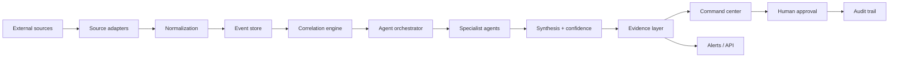

# Technical Architecture

## 1. Target architecture



## 2. Source layer

Production adapters should be isolated by provider. Recommended interface:

```ts
interface SourceAdapter {
  id: string;
  domain: 'geopolitical' | 'infrastructure' | 'economy' | 'climate' | 'mobility';
  health(): Promise<{ ok: boolean; latencyMs: number }>;
  poll(cursor?: string): Promise<Observation[]>;
}
```

This makes source replacement possible without rewriting the dashboard.

## 3. Canonical observation

The canonical event is the platform's most important contract.

Required fields:

- id
- source
- observedAt
- ingestedAt
- domain
- severity
- confidence
- freshness
- location
- provenance

Optional fields:

- entities
- dependencies
- raw payload reference
- attachments
- classification
- customer tenant

## 4. Agent orchestration

Recommended roles:

| Agent | Responsibility |
|---|---|
| Aegis | geopolitical/security risk |
| Kratos | infrastructure dependencies |
| Midas | markets/commodities/crypto |
| Poseidon | maritime/logistics |
| Gaia | climate/environment |
| Hermes | synthesis, prioritization and communication |

Agents should not be treated as independent sources of truth. They are reasoning layers over governed observations.

## 5. Decision pipeline

```text
Observation
   ↓
Validation
   ↓
Enrichment
   ↓
Correlation
   ↓
Agent analysis
   ↓
Cross-agent disagreement check
   ↓
Confidence score
   ↓
Human review when required
   ↓
Decision / alert
```

## 6. Data storage

Target:

- PostgreSQL for tenants, users, observations and configuration.
- Object storage for raw source payloads.
- Optional vector index for semantic retrieval.
- Event/audit table for critical changes.
- Redis or managed queue for burst ingestion.

## 7. Multi-tenancy

Every enterprise object should contain `tenant_id`.

Enforce isolation at:

1. application authorization;
2. database row-level security;
3. API authorization;
4. background job context.

## 8. Observability

Track:

- ingestion latency;
- source failure rate;
- event freshness;
- agent latency;
- token cost;
- agent disagreement;
- alert precision;
- false-positive rate;
- user acknowledgement;
- time-to-decision.

## 9. Production boundary

The current demo intentionally keeps synthetic data in the frontend and transient chat state in memory. Production must move those responsibilities behind authenticated services and persistent storage.

Vercel supports Express deployments as a single Function and also supports native Vercel Functions; the architecture should keep the API boundary clean so the backend can evolve without coupling the UI to infrastructure. 

## 10. AI governance

Do not allow the model to silently convert uncertainty into facts.

Each AI response should expose:

- evidence references;
- model ID;
- generatedAt;
- confidence;
- assumptions;
- conflicting observations;
- human approval state.

## 11. Security controls

- secret manager for API keys;
- signed webhooks where supported;
- request validation;
- rate limiting;
- audit logs;
- role-based access;
- encrypted storage;
- dependency scanning;
- SAST/DAST in CI;
- incident response runbook.
